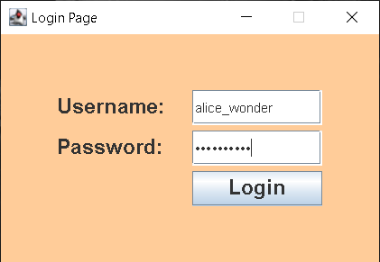
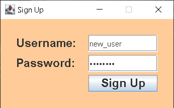

# Blogging Application

This is a simple blogging application built using Java AWT and Swing for the graphical user interface (GUI) and MySQL Connector/J (JDBC) for database connectivity. The application allows users to sign up, log in, write blogs, read blogs, and search for blogs by title, author, or topic.

## Features

- **User Authentication**: Sign up and log in functionality with secure password handling.
- **Write Blog**: Create and publish new blog posts.
- **Read Blogs**: Browse and read existing blogs.
- **Search Blogs**: Search for blogs by title, author, or topic.

## Technologies Used

- **Java AWT and Swing**: For building the graphical user interface.
- **MySQL Connector/J (JDBC)**: For connecting the application to a MySQL database.
- **MySQL Database**: For storing user credentials and blog information.

## Prerequisites

Before you begin, ensure you have met the following requirements:

- Java Development Kit (JDK) installed on your computer.
- MySQL Server installed and running.
- MySQL Connector/J (JDBC) included in your project's classpath.

## Installation

1. Clone this repository to your local machine:

    ```bash
    git clone https://github.com/your-username/your-repo-name.git
    ```

2. Import the project into your preferred Java IDE (e.g., IntelliJ IDEA, Eclipse).

3. Set up the MySQL database:

    - Create a database named `blogging_app`.
    - Run the SQL scripts provided in the `sql/` directory to create the necessary tables.
    - Update the database connection parameters in the Java code (if needed).

4. Build and run the project from your IDE.

## Usage

- **Sign Up**: Create a new account by providing your username and password.
- **Log In**: Access your account using your credentials.
- **Write a Blog**: Navigate to the 'Write Blog' section to create and publish a new blog post.
- **Read Blogs**: Browse through the list of blogs available in the 'Read Blogs' section.
- **Search Blogs**: Use the search functionality to find blogs by title, author, or topic.

## Screenshots

| Login Screen | Sign Up Screen |
|--------------|----------------|
|  |  |

| Write Blog Screen | Read Blogs Screen |
|-------------------|-------------------|
|  |  |

## Database Schema

- **Users Table**: Stores user credentials and information.
- **Blogs Table**: Stores blog posts with details like title, author, content, and topic.

## Contributing

Contributions are always welcome! Please feel free to submit a Pull Request.

## License

This project is licensed under the MIT License - see the [LICENSE](LICENSE) file for details.

## Contact

If you have any questions or feedback, please contact:

- **Your Name**: [Your Email]
- **GitHub**: [Your GitHub Profile]

